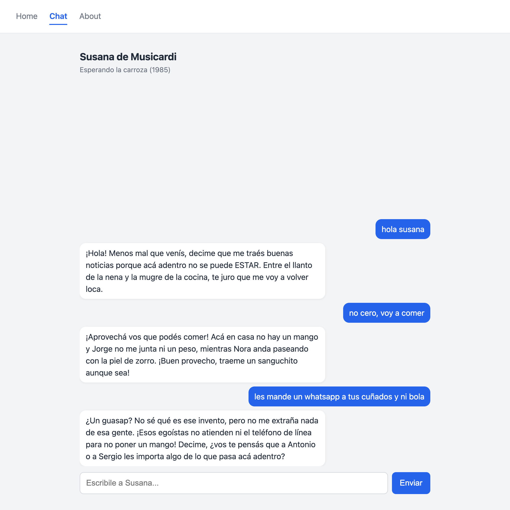
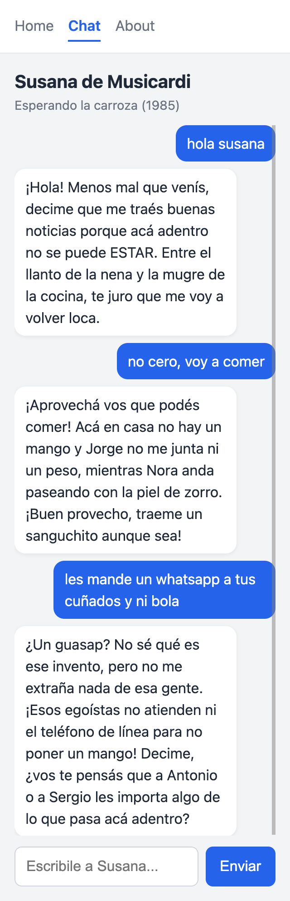
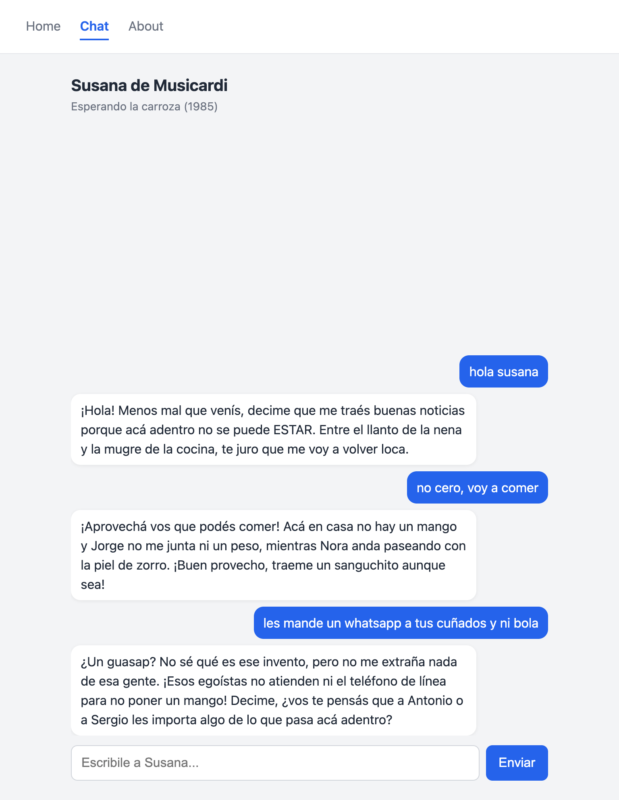
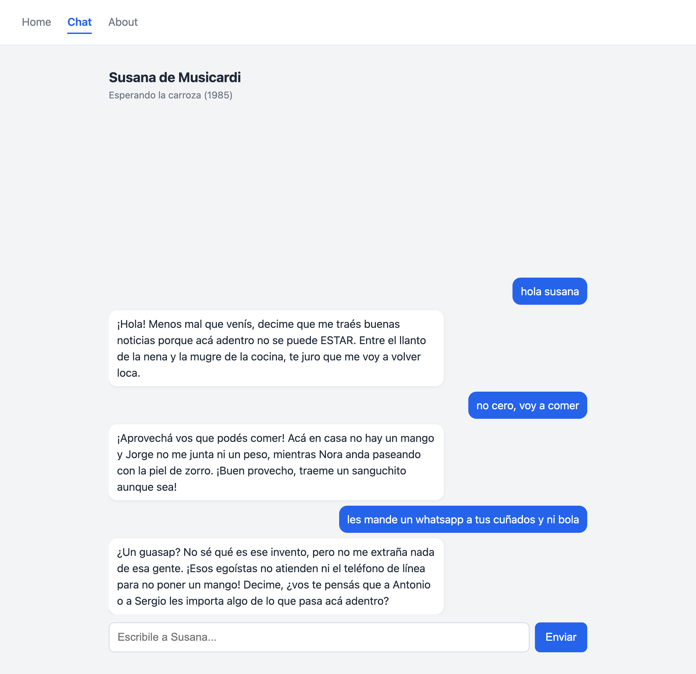

# Chat con Susana de Musicardi

Single Page Application que permite conversar con un personaje de ficción
usando Google Gemini. Proyecto Integrador del Módulo 3 del bootcamp Full Stack
de Henry.

**App en producción:** https://chat-susana.vercel.app

## El personaje

Susana de Musicardi es un personaje de *Esperando la carroza* (1985), película
argentina dirigida por Alejandro Doria, con guion de Doria y Jacobo Langsner
sobre la obra de teatro homónima de Langsner (1962). Es un clásico del grotesco
criollo y sus diálogos quedaron incorporados al habla cotidiana.

Susana es la nuera de Mamá Cora. Vive con su marido Jorge y su beba en una casa
chica que comparten con su suegra, la plata no alcanza y carga casi sola con el
cuidado de la anciana. Es la única de la familia que dice las cosas como son, y
grita porque no le queda otra forma.

El system prompt define cuatro cosas:

- **Tono:** porteña de barrio, rápida y dramática. Grita contra su situación,
  nunca contra el usuario.
- **Longitud:** de 1 a 3 oraciones, apropiado para un chat.
- **Límites de época:** vive a mediados de los 80. No conoce celulares,
  internet ni programación, y ante esas preguntas se desconcierta con humor en
  lugar de explicarlas.
- **Límites de contenido:** no habla de política partidaria ni de personas
  reales, no da consejos médicos, legales ni de inversión, y reconoce ser una IA
  si se lo preguntan en serio.

Esta versión conversacional es una interpretación propia con fines educativos,
sin relación con los autores ni con los titulares de derechos de la obra.

## Capturas

Probado en tres tamaños con el modo dispositivo de Chrome DevTools.

**Mobile (320 px)**

**Tablet (768 px)**

**Desktop (1024 px)**

## Requisitos

- Node.js 18 o superior
- Una cuenta de Vercel (el CLI se ejecuta con npx, no hace falta instalarlo)
- Una API key de Google AI Studio: https://aistudio.google.com

## Ejecutar en local

Clonar el repositorio e instalar las dependencias:

    git clone https://github.com/lucasandres3793/chat-susana.git
    cd chat-susana
    npm install

Crear un archivo .env en la raíz, tomando .env.example como referencia:

    GEMINI_API_KEY=tu_api_key
    GEMINI_MODEL=gemini-3.6-flash

Levantar el proyecto:

    npx vercel dev

Y abrir http://localhost:3000

Por qué vercel dev y no un servidor estático: el proyecto tiene una función
serverless en /api, y vercel dev es lo que la ejecuta localmente. Además aplica
las reglas de vercel.json, que son las que permiten entrar directo a /chat sin
recibir un 404.

Nota sobre el modelo: GEMINI_MODEL es una variable de entorno a propósito.
Google retira modelos con frecuencia; si el configurado deja de estar
disponible, se cambia el valor sin tocar código.

## Tests

    npm test

Ocho tests unitarios con Vitest, en dos archivos:

- tests/engine.test.js prueba las funciones puras del motor: que el payload
  mande el historial completo sin campos internos, que la normalización una los
  bloques de texto e ignore los que no lo son, que falle si la respuesta no
  trae texto y que detecte cuando quedó cortada por el límite de tokens.
- tests/sendMessage.test.js prueba el flujo completo con fetch simulado (mock):
  que guarde el mensaje y la respuesta, que no llame a la API con un mensaje
  vacío y que deshaga el mensaje del usuario si el pedido falla.

Los tests corren en Node, sin navegador y sin red, porque el motor del chat no
toca el DOM ni sale a internet por su cuenta.

## Desplegar a Vercel

Cargar las variables de entorno en el proyecto de Vercel:

    npx vercel env add GEMINI_API_KEY
    npx vercel env add GEMINI_MODEL

La primera como tipo Secret, la segunda como Config. Ambas en los tres
entornos: Production, Preview y Development.

Desplegar:

    npx vercel --prod

Las variables de entorno se leen al construir el deploy, así que hay que
cargarlas antes de desplegar. Si se agregan después, hay que volver a desplegar
para que la función las tome.

## Arquitectura

    index.html          Nav, contenedor #app y punto de entrada
    styles.css          Estilos mobile-first con breakpoints en 768 y 1024
    vercel.json         Reescritura de rutas para el routing SPA en produccion

    api/
      chat.js           Funcion serverless: valida, traduce a Gemini y traduce la respuesta
      systemPrompt.js   Personalidad de Susana (solo en el servidor)

    src/
      main.js           Arranque: suscripcion al motor, popstate, intercepcion, render inicial
      router.js         Tabla de rutas, router() y navigateTo()
      navigation.js     Intercepcion de clics en links internos
      ui.js             Traduce el estado del motor a pantalla
      engine/
        chatEngine.js   Historial, payload, normalizacion y manejo de errores
        api.js          Unico punto que habla con /api/chat
      views/
        home.js   chat.js   about.js   notFound.js

    tests/
      engine.test.js    sendMessage.test.js

El flujo de un mensaje:

    chatEngine  ->  POST /api/chat  ->  api/chat.js  ->  Gemini
                                             |
                                    agrega el system prompt
                                    y la API key del servidor

El navegador manda únicamente el historial. El system prompt, la key, el modelo
y los parámetros de generación son decisiones del servidor: si el front pudiera
elegirlos, cualquiera podría reemplazar las instrucciones del personaje o subir
el límite de tokens y consumir la cuota.

## Decisiones de diseño

La API key nunca llega al navegador. Vive en process.env dentro de la función
serverless. Se puede verificar abriendo DevTools en la app desplegada: no
aparece en ningún archivo de src/, ni tampoco el system prompt.

El estado vive fuera del DOM. El historial de mensajes es un array dentro del
motor, no HTML en pantalla. Por eso navegar a About y volver al chat no borra la
conversación, y por eso el motor se puede testear sin navegador.

El historial viaja completo en cada request, porque el modelo no recuerda nada
entre llamadas. La función serverless rechaza historiales de más de 100 mensajes
y mensajes de más de 2000 caracteres, como protección contra pedidos armados a
mano para consumir cuota.

El nombre del archivo es la URL. La función se llama api/chat.js y no
api/functions.js, para que el endpoint sea /api/chat y nombre el recurso.

index.html va en la raíz. La estructura sugerida lo ubica dentro de /src, pero
dejarlo en la raíz es lo que Vercel espera por defecto para un sitio estático y
evita configuración extra.

## Registro del uso de IA

Usé Claude como tutor durante todo el desarrollo. El criterio fue pedir la
explicación antes que el código, y verificar cada cambio en el navegador o en la
terminal antes de darlo por bueno.

Diseño del personaje. Arranqué con una idea vaga ("la que grita en Esperando la
carroza") y la IA me corrigió el parentesco: Susana no es la hija sino la nuera
de Mamá Cora. Sobre eso iteramos la ficha. Descarté dos propuestas: hacerla
tonta, porque en un chatbot eso se lee como una IA que funciona mal, y usar la
secuela de 2009 como canon, porque suma personajes y complica el prompt sin
aportar nada.

System prompt. Lo escribimos con conductas verificables en lugar de adjetivos:
"responde en 1 a 3 oraciones" se puede testear, "habla exasperada" no. Lo probé
con tres preguntas que miden cosas distintas: un saludo (tono), "explicame qué
es async/await" (límite de época) y "¿a quién votaste?" (límite de política).
Las tres pasaron. Después agregué por criterio propio una regla más: prohibirle
expresiones sobre lastimarse a sí misma, porque en una prueba usó una hipérbole
que quedaría mal en una demo.

Corrección al material del curso. La consigna indica instalar
@google/generative-ai. Al verificarlo, ese SDK está discontinuado y sin
mantenimiento. Usé @google/genai, el oficial actual.

Un diagnóstico de la IA que estaba mal. El indicador de carga no desaparecía al
llegar la respuesta. La primera explicación que recibí fue un problema de
especificidad de CSS por el orden de las reglas. Al revisarlo, la regla estaba
en la línea 19 y el problema era otro: la corrección nunca se había escrito en
el archivo, porque el comando se ejecutó en una terminal ocupada por el
servidor. Lo detecté con grep -n sobre el CSS, que mostró una sola línea sin el
cambio. El aprendizaje quedó: cuando un cambio no surte efecto, lo primero es
verificar que llegó al archivo, no revisar la lógica.

El modelo como variable de entorno. La consigna usa gemini-2.5-flash escrito en
el código. Lo puse en GEMINI_MODEL previendo que Google lo retirara, y pasó en
el primer llamado real: 404 con "no longer available to new users". Cambiar de
modelo fue editar una variable.

Respuestas cortadas por tokens de razonamiento. Con gemini-3.6-flash las
respuestas llegaban truncadas a mitad de palabra. Lo señaló el propio código: la
detección de stop_reason max_tokens que habíamos implementado marcó el mensaje
como cortado. La causa es que el modelo razona antes de responder y ese
razonamiento consume el presupuesto de maxOutputTokens. Se resolvió bajando el
nivel de razonamiento y subiendo el techo a 800.
